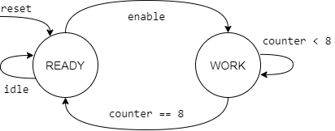
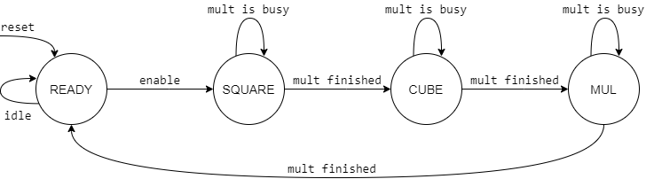

# Лабораторная работа №2 по функциональной схемотехнике «Разработка аппаратных ускорителей математических вычислений»

Выполнили: Акатьев Никита, Трушкина Вера гр. P33111

[Лабораторная работа №1](lab1/README.md)

## Текст задания

1. Разработайте и опишите на Verilog HDL схему, вычисляющую значение функции в соответствии с заданными ограничениями согласно варианту задания.
2. Определите область допустимых значений функции.
3. Разработайте тестовое окружение для разработанной схемы.
4. Проведите моделирование работы схемы и определите время вычисления результата. Схема должна тактироваться от сигнала с частотой 100 МГц.

**Функция**: `a^3 + ab` \
**Ограничения**: 2 сумматора и 1 умножитель

## Описание функции

### Пошаговые операции:
1. `a^2 = a * a`
2. `a^3 = a^2 * a`
3. `ab = a * b`
4. `Результат = a^3 + ab`

Если `a` и `b` - 8-разрядные беззнаковые числа, то для хранения результата требуется 24 разряда.

### Конечные автоматы для модулей:

**Модуль умножения** \


`READY` - схема простаивает, ожидает новые данные для обработки. Когда в этом состоянии приходит сигнал `enable`, схема переходит в `WORK` и подготавливает входные и выходные данные для обработки модулем.

`WORK` - схема вычисляет произведение входных аргументов. На каждом шаге, текущий результат сдвигается вправо и к нему прибавляется значение первого операнда, если соответствующий бит второго операнда равен 1. Операция повторяется 8 раз, после чего схема возвращается в состояние `READY` и ожидает следующих данных.

**Основной модуль** \


`READY` - схема простаивает, ожидает аргументы `a` и `b`. Когда в этом состоянии приходит сигнал `enable`, схема переходит в `SQUARE` и параллельно запускает модуль умножения, передавая ему два операнда - `a` и `a`.

`SQUARE` - схема ожидает окончания работы модуля умножения. Когда он закончил подсчет `a^2`, схема переходит в `CUBE` и запускает модуль умножения снова, передавая в него операнды `a^2` и `a`.

`CUBE` - схема ожидает окончания работы модуля умножения. Когда он закончил подсчет `a^3`, схема переходит в `MUL` и запускает модуль умножения снова, передавая в него операнды `a` и `b`.

`MUL` - схема ожидает окончания работы модуля умножения. После этого, схема складывает `a^3` и `ab`, полученные на двух предыдущих шагах, и возвращается в состояние `READY`, ожидая следующих данных.

### Время вычисления результата:

Значение функции будет получено ровно за 30 тактов - модуль умножения требует 9 тактов + три такта для переходов между разными состояниями. При тактовой частоте 100 МГц имеем длительность такта 10 нс => время вычисления результата - 300 нс.

## Исходный код

[mult.v](mult.v) - модуль умножения, [mult_tb.v](mult_tb.v) - его тестовое окружение для симуляций и отладки

[main_function.v](mult.v) - основной модуль, [main_function_tb.v](mult_tb.v) - его тестовое окружение для симуляций и отладки


# Лабораторная работа №3 по функциональной схемотехнике «Проектирование цифровых схем с использованием ПЛИС»

## Текст задания

Доработайте схему функционального блока, разработанного в лабораторной работе №2, в соответствии с рисунком 3.1. Необходимо добавить возможность работы с блоком посредством дискретных портов ввода/вывода, подключенных к переключателям, светодиодам и кнопкам платы Nexys 4 DDR:

* значения операндов должны вводиться с помощью переключателей (SW);
* результат должен выводиться на светодиоды (LEDS);
* с целью повышения удобства работы пользователя допускается использование дополнительных кнопок, переключателей и светодиодов;
* интерфейс пользователя должен обеспечивать возможность многократного проведения вычислений без постоянного нажатия на кнопку сброса.

Дополнительное задание - результат должен выводиться на восьмиразрядный семисегментный дисплей (AN, CA-CG)

## Элементы платы, используемые цифровой схемой

### Элементы ввода:

* Генератор тактов `CLK100MHZ` ─ синхронизация выполнения модулей, счетчики;
* Переключатели `SW[15:8]` ─ значение аргумента `a` в двоичном формате;
* Переключатели `SW[7:0]` ─ значение аргумента `b` в двоичном формате;
* Кнопка `BTNC` ─ сигнал начала вычисления;
* Кнопка `BTNR` ─ сигнал сброса.

### Элементы вывода:

* Светодиоды `LED[15:0]` ─ отладочные данные;
* Семисегментные индикаторы `AN[7:0]`, `CA..CG` ─ значение результата в десятичном формате.

## Реализация цифровой схемы с использованием элементов ПЛИС

Сам модуль вычисления практически не изменился по сравнению с лабораторной работой №2. Был написан hardware модуль, работающий конкретно с самими элементами платы.

Все элементы ввода были напрямую подключены к соответствующим входам в основной модуль:
* `CLK100MHZ` подключен в качестве `clock` сигнала ко всем модулям
* `SW` ─ соответствующие регистры `a` и `b`
* `BTNC` ─ сигнал `enable` для основного модуля
* `BTNR` ─ сигнал `reset` для всех модулей

**TODO**: обработка дребезга (bouncing) кнопок. В этой лабораторной она не потребовалась, т.к. многократное переключение сигналов `enable` и `reset` за короткое время не может отразиться на выходных данных схемы. Обработка дребезга может пригодиться, например, если появится необходимость в кнопке-переключателе (переключение операций по кнопке, отображения выходных данных, т.д.).

### Реализация вывода на семисегментный дисплей

1. Преобразование двоичного результата вычисления (регистр `result`) в двоично-десятичный формат

Для этих целей был использован 32-разрядный регистр `result_bcd`, каждая тетрада которого отвечала за соответствующую десятичную цифру. Для каждой цифры была использована формула `result / 10^N % 10`, где `N` - номер цифры, считая справа и начиная с 0.

**TODO**: аппаратная реализация этой формулы довольно тяжелая из-за наличия операций деления и остатка от деления. Попробовать более простой для hardware алгоритм вроде [Double dabble](https://en.wikipedia.org/wiki/Double_dabble).

2. Определение разряда и отображаемой в нем цифры

ПЛИС Nexys 4 DDR поддерживает единовременное отображение только одного из 8 индикаторов. Однако, задав достаточно большую скорость переключения отображаемых разрядов, можно добиться результата, при котором все восемь будут зажжены, но мерцание не будет заметно человеческому глазу.

В качестве интервала переключения было выбрано 20 мс - то есть, каждый из регистров будет зажигаться 50 раз в секунду. Каждые `20 / 8 = 2.5` мс выбирается следующая цифра - в регистре `AN` соответствующим образом сдвигаются биты. С помощью сдвигов регистра `result_bcd` определяется значение `num` - цифра для отображения.

К тому же, программно учтены еще два момента:
* Во время выполнения модуля вычисления дисплей не отображает результат - в регистр `AN` проставляются все единицы. С точки зрения пользователя, экран будет потушен все время, пока он будет держать кнопку `BTNC (enable)`
* Если текущая цифра является ведущим нулем, она тоже не отображается.

3. Определение сегментов, которые необходимо отрисовать для данной цифры

Таблица ниже отображает, какие из сегментов должны быть включены, чтобы на индикаторе отобразилась соответствующая цифра. На рисунке каждый сегмент подписан соответствующей буквой.

```
┏━━━━━━━┳━━━┯━━━┯━━━┯━━━┯━━━┯━━━┯━━━┓            ┏━━━━━━━━━━━━━━━━━┓
┃ Цифра ┃ A │ B │ C │ D │ E │ F │ G ┃            ┃        A        ┃
┣━━━━━━━╋━━━┿━━━┿━━━┿━━━┿━━━┿━━━┿━━━┩    ┏━━━━━┓ ┗━━━━━━━━━━━━━━━━━┛ ┏━━━━━┓
┃   0   ┃ 1 │ 1 │ 1 │ 1 │ 1 │ 1 │ 0 │    ┃     ┃                     ┃     ┃ 
┣━━━━━━━╉───┼───┼───┼───┼───┼───┼───┤    ┃     ┃                     ┃     ┃ 
┃   1   ┃ 0 │ 1 │ 1 │ 0 │ 0 │ 0 │ 0 │    ┃     ┃                     ┃     ┃ 
┣━━━━━━━╉───┼───┼───┼───┼───┼───┼───┤    ┃  F  ┃                     ┃  B  ┃ 
┃   2   ┃ 1 │ 1 │ 0 │ 1 │ 1 │ 0 │ 1 │    ┃     ┃                     ┃     ┃ 
┣━━━━━━━╉───┼───┼───┼───┼───┼───┼───┤    ┃     ┃                     ┃     ┃ 
┃   3   ┃ 1 │ 1 │ 1 │ 1 │ 0 │ 0 │ 1 │    ┃     ┃                     ┃     ┃ 
┣━━━━━━━╉───┼───┼───┼───┼───┼───┼───┤    ┗━━━━━┛ ┏━━━━━━━━━━━━━━━━━┓ ┗━━━━━┛ 
┃   4   ┃ 0 │ 1 │ 1 │ 0 │ 0 │ 1 │ 1 │            ┃        G        ┃ 
┣━━━━━━━╉───┼───┼───┼───┼───┼───┼───┤    ┏━━━━━┓ ┗━━━━━━━━━━━━━━━━━┛ ┏━━━━━┓
┃   5   ┃ 1 │ 0 │ 1 │ 1 │ 0 │ 1 │ 1 │    ┃     ┃                     ┃     ┃
┣━━━━━━━╉───┼───┼───┼───┼───┼───┼───┤    ┃     ┃                     ┃     ┃
┃   6   ┃ 1 │ 0 │ 1 │ 1 │ 1 │ 1 │ 1 │    ┃     ┃                     ┃     ┃
┣━━━━━━━╉───┼───┼───┼───┼───┼───┼───┤    ┃  E  ┃                     ┃  C  ┃
┃   7   ┃ 1 │ 1 │ 1 │ 0 │ 0 │ 0 │ 0 │    ┃     ┃                     ┃     ┃
┣━━━━━━━╉───┼───┼───┼───┼───┼───┼───┤    ┃     ┃                     ┃     ┃
┃   8   ┃ 1 │ 1 │ 1 │ 1 │ 1 │ 1 │ 1 │    ┃     ┃                     ┃     ┃
┣━━━━━━━╉───┼───┼───┼───┼───┼───┼───┤    ┗━━━━━┛ ┏━━━━━━━━━━━━━━━━━┓ ┗━━━━━┛
┃   9   ┃ 1 │ 1 │ 1 │ 1 │ 0 │ 1 │ 1 │            ┃        D        ┃
┗━━━━━━━┹───┴───┴───┴───┴───┴───┴───┘            ┗━━━━━━━━━━━━━━━━━┛
```

(table created via [cli-tables library](https://github.com/BobIsOnFire/cli-tables-rs))


В случае данной ПЛИС, каждый сигнал должен быть инвертирован. В программе каждый регистр напрямую проставляется исходя из того, какую цифру нужно нарисовать. Конечно, есть возможность построить полную таблицу истинности, минимизировать каждую из формул и получить формулы для вычисления регистров, но вполне возможно, что Vivado уже проводит подобные оптимизации за нас.

## Исходный код

[hardware.v](hardware.v) - связь модуля вычислений и элементов ПЛИС

[hardware_tb.v](hardware_tb.v) - тестовое окружение для симуляции использования элементов
