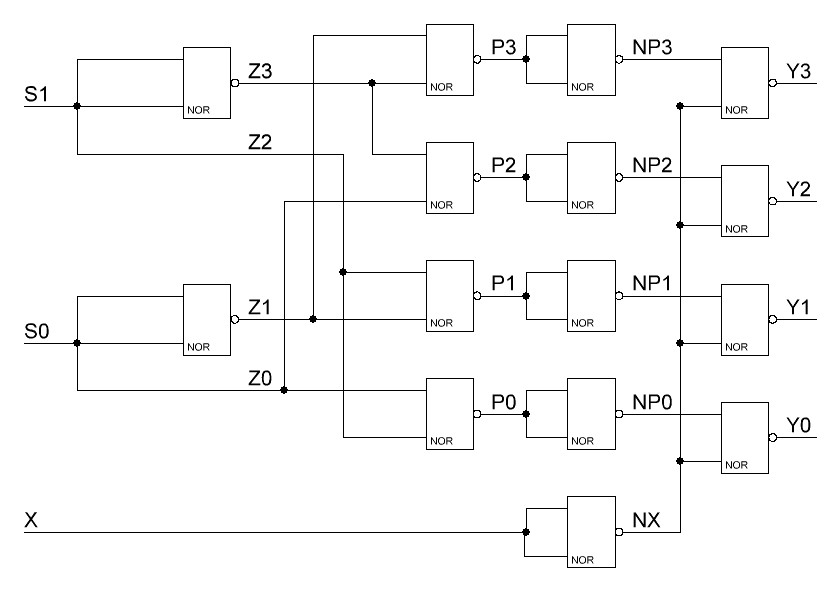

# Лабораторная работа №1 по функциональной схемотехнике «Введение в проектирование цифровых интегральных схем»

Выполнил: Акатьев Никита гр. P33111

## Содержание
[Текст задания](#текст-задания) \
[Описание БОЭ](#описание-боэ) \
[Исходный код](#исходный-код)

## Текст задания

1. Опишите на Verilog HDL на вентильном уровне модуль, реализующий функцию БОЭ в указанном логическом базисе согласно варианту задания.
2. Разработайте тестовое окружение для созданного модуля.
3. Проведите моделирование работы схемы.
4. Составьте отчет по результатам выполнения лабораторной работы.

**Логический базис**: NOR (ИЛИ-НЕ) \
**БОЭ**: Демультиплексор «1 в 4»

## Описание БОЭ

Сигналы `s1s0` с помощью двоичного числа кодируют один из четырех выходов ` 0 0 0 0`. На закодированный выход передается значение основного входного сигнала `x`, на остальные – передается `0`.

### Таблица истинности:
```
┌──────────────╥───────────────────┐
│     Input    ║       Output      │
├────┬────┬────╫────┬────┬────┬────┤
│  x │ s1 │ s0 ║ y0 │ y1 │ y2 │ y3 │
├────┼────┼────╫────┼────┼────┼────┤
│  0 │  0 │  0 ║  0 │  0 │  0 │  0 │
│  0 │  0 │  1 ║  0 │  0 │  0 │  0 │
│  0 │  1 │  0 ║  0 │  0 │  0 │  0 │
│  0 │  1 │  1 ║  0 │  0 │  0 │  0 │
│  1 │  0 │  0 ║  1 │  0 │  0 │  0 │
│  1 │  0 │  1 ║  0 │  1 │  0 │  0 │
│  1 │  1 │  0 ║  0 │  0 │  1 │  0 │
│  1 │  1 │  1 ║  0 │  0 │  0 │  1 │
└────┴────┴────╨────┴────┴────┴────┘
```

### Общая реализация: 
* Построить дешифратор «2 в 4».
* Использовать дешифратор «2 в 4» для входных сигналов `s1s0`, чтобы получить набор сигналов `p0p1p2p3` – они определяют, в какой из выходов направить основной сигнал `x`.
* С помощью гейта AND соединить сигнал `x` с каждым из `p0p1p2p3` и получить набор выходных сигналов `y0y1y2y3`.

### Схема:


## Исходный код

[demultiplexer.v](demultiplexer.v) - модуль, реализующий функциональность

[demultiplexer_tb.v](demultiplexer_tb.v) - модуль тестирования